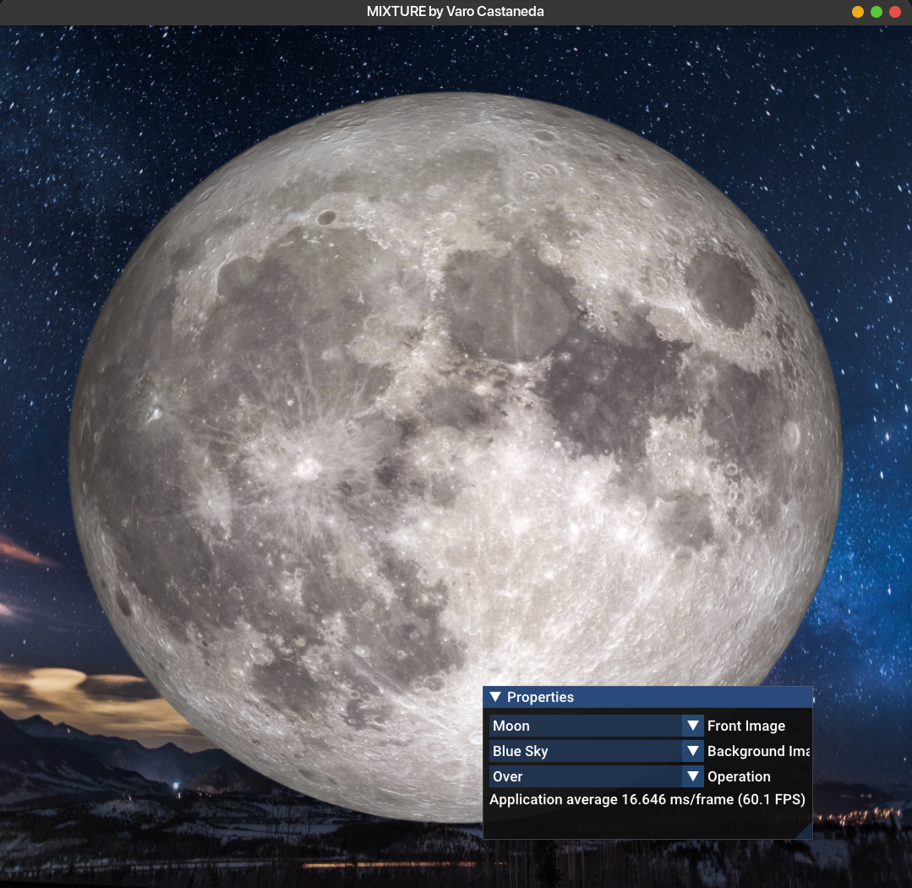

# CPPND: Capstone Compositor project

By Varo Castaneda

### GOALS

* Use 2 images only ✅
* have common composite operations ✅
* load custom images ✅ (partial)
* transform controls for each layer
* simple color correction

## Rubrik Points

## Dependencies for Running Locally

* cmake >= 3.7
    * All OSes: [click here for installation instructions](https://cmake.org/install/)
* make >= 4.1 (Linux, Mac), 3.81 (Windows)
    * Linux: make is installed by default on most Linux distros
    * Mac: [install Xcode command line tools to get make](https://developer.apple.com/xcode/features/)
    * Windows: [Click here for installation instructions](http://gnuwin32.sourceforge.net/packages/make.htm)
* gcc/g++ >= 5.4
    * Linux: gcc / g++ is installed by default on most Linux distros
    * Mac: same deal as make - [install Xcode command line tools](https://developer.apple.com/xcode/features/)
    * Windows: recommend using [MinGW](http://www.mingw.org/)

## Basic Build Instructions

1. Clone this repo using recursive to get
   submodules. `git clone --recursive https://github.com/varomix/CppND-Capstone-Compositor.git`
2. Install linux dependencies `sudo apt install libglfw3-dev libglm-dev`
3. Make a build directory in the top level directory: `mkdir build && cd build`
4. Compile: `cmake .. && make`
5. Run it: `./CPPNG_CompositorPrototype`.

## About the Project

I like to create applications related to computer graphics. In film and Visual Effects we use applications called a
compositor,
that replaces the old way of putting film on top of each other and re-filming, bringing that process to the digital
world
make it much more simple nad flexible to work on getting the results you need.
I wanted to make something that has interface and graphics, I like to combine those elements, having controls to
modify and image feels like magic to me.

The project should should show 2 images, a background and a foreground, there is also a gui window with controls
to control the composite, use the Front Image and Background Image to select different images, use the Operations
combobox to apply different compositing operations on the images.

## Project Tree

* **root** : &ensp;&ensp;&ensp;&ensp;&ensp;&ensp;&ensp;&ensp;&ensp;&ensp;&ensp;Main project directory
* **images** : &ensp;&ensp;&ensp;&ensp;&ensp;&ensp;&ensp;&ensp;Images used in the composite
* **src** : &ensp;&ensp;&ensp;&ensp;&ensp;&ensp;&ensp;&ensp;&ensp;&ensp;&ensp;&ensp;Main source folder
    * **api** : &ensp;&ensp;&ensp;&ensp;&ensp;&ensp;&ensp;&ensp;Helper classes for the OpenGL context
    * **shaders** : &ensp;&ensp;&ensp;GLSL Shader source files
    * **vendor** : &ensp;&ensp;&ensp;&ensp;Third party dependencies/libraries

## Rubrik requirements

#### Loops, Functions, I/O

Loop :
main.cpp : 279
| [Main while Loop](https://github.com/varomix/CppND-Capstone-Compositor/blob/90d01ce2bd563d115e3dc00ac4368f4c48acd980/src/main.cpp#L279)

Functions: src/utils.h : 12
| [Load Texture function](https://github.com/varomix/CppND-Capstone-Compositor/blob/90d01ce2bd563d115e3dc00ac4368f4c48acd980/src/utils.h#L12)

I/O:
main.cpp: 187/ 199 |
[Load Image files as Texture](https://github.com/varomix/CppND-Capstone-Compositor/blob/90d01ce2bd563d115e3dc00ac4368f4c48acd980/src/main.cpp#L199)

User Input:
main.cpp : 299
| [Through the GUI ](https://github.com/varomix/CppND-Capstone-Compositor/blob/90d01ce2bd563d115e3dc00ac4368f4c48acd980/src/main.cpp#L299)

#### Object Oriented Programming

Classes: api folder contains classes for Camera and Shader used in the project

Classes use appropriate access specifiers for class
members. [mix_shader.h : public](https://github.com/varomix/CppND-Capstone-Compositor/blob/90d01ce2bd563d115e3dc00ac4368f4c48acd980/src/api/mix_shader.h#L16)

[mix_shader.h : private](https://github.com/varomix/CppND-Capstone-Compositor/blob/90d01ce2bd563d115e3dc00ac4368f4c48acd980/src/api/mix_shader.h#L124)

Classes encapsulate behavior. utils.h : 25
| [behavior](https://github.com/varomix/CppND-Capstone-Compositor/blob/90d01ce2bd563d115e3dc00ac4368f4c48acd980/src/utils.h#L25)

The project makes use of references in function declarations : src/utils.h : 12
| [Pointer reference](https://github.com/varomix/CppND-Capstone-Compositor/blob/90d01ce2bd563d115e3dc00ac4368f4c48acd980/src/utils.h#L12)

### Future plans

I want to continue building this application and make it useful for VFX production and add many more features.

Thank you
